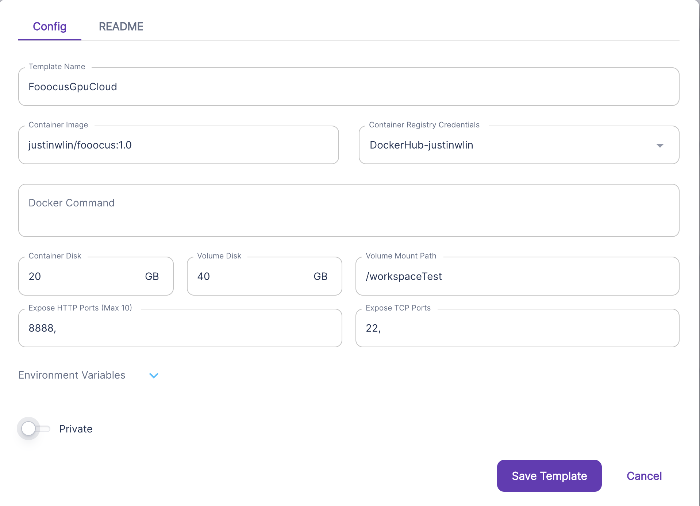

https://hub.docker.com/repository/docker/justinwlin/fooocus/general

Can set up the Runpod GPU instance as specified in the picture.

Make sure to set the Mount Path as ANYTHING other than /workspace

Make sure to open up the terminal, and run:
```
python entry_with_update.py --share --listen
```

This will give you a live link.

Example template setup:
(Note you don't need the container registry credentials. Is optional, if you want you can add it to your Runpod Settings > Container Registry Auth) if you want. I found that sometimes my container was stuck forever downloading. 



Notes:
1. When you connect to the pod you first need to go to the HTTP web terminal

When you are there run:
```
jupyter server list
```

This will give you a token you can use to login to jupyter notebook.

```
http://localhost:8888/?token=vltd4aj00leunfunxdl3 :: /
```

The token is:
```
vltd4aj00leunfunxdl3
```

2. Now go back to runpod and open up jupyter notebook by connecting to http 8888:
Paste in your token specific for you to the top input bar.

3. You can now open up a terminal in the juptyer notebook and cd to:
/workspace/Fooocus

4. Now you can run:
python entry_with_update.py --share --listen

And you'll get something like below:
```
root@15a38e07c662:/workspace/Fooocus# python entry_with_update.py --share --listen
Update failed.
Repository not found at /workspace/Fooocus
Update succeeded.
[System ARGV] ['entry_with_update.py', '--share', '--listen']
Python 3.10.12 (main, Nov 20 2023, 15:14:05) [GCC 11.4.0]
Fooocus version: 2.1.824
Running on local URL:  http://0.0.0.0:7865
Total VRAM 24217 MB, total RAM 257665 MB
xformers version: 0.0.22
Set vram state to: NORMAL_VRAM
Disabling smart memory management
Device: cuda:0 NVIDIA GeForce RTX 4090 : native
VAE dtype: torch.bfloat16
Using xformers cross attention
Refiner unloaded.
Running on public URL: https://83ebfeb801ad1d20d8.gradio.live
```

# Note
If you want to build this yourself, and you are on a Mac or something, you can use something like depot:

https://depot.dev/
```
depot build -t justinwlin/fooocus:1.0 . --push --platform linux/amd64
```

Breakdown of the command:
```
depot build -t yourdockerusername/yourimagename:yourversionnumber . --push --platform linux/amd64
```

