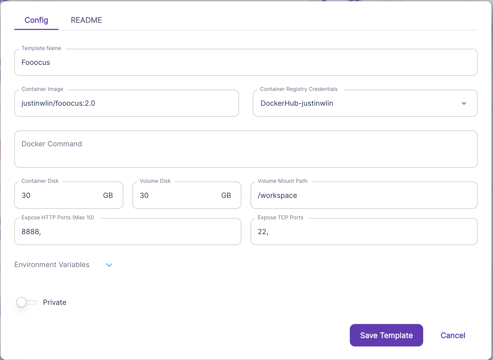

https://hub.docker.com/repository/docker/justinwlin/fooocus/general

Runpod Link:
https://runpod.io/gsc?template=8q4vl4gfld&ref=wqryvm1m

Can set up the Runpod GPU instance as specified in the picture.

Make sure to open up the terminal, and run from the /Fooocus directory:
```
python entry_with_update.py --share --listen
```

This will give you a live link.

Example template setup:
(Note you don't need the container registry credentials. Is optional, if you want you can add it to your Runpod Settings > Container Registry Auth) if you want. I found that sometimes my container was stuck forever downloading. 

NOTE! I RECOMMEND TO ALWAYS CHECK THE DOCKER HUB LINK. The latest version whether it is :1.0, 2:0, etc will be the best one. I only keep the latest version around,
if I feel it is an improvement.


Notes:
1. When you connect to the pod you first need to go to the HTTP web terminal

When you are there run:
```
jupyter server list
```

This will give you a token you can use to login to jupyter notebook.

```
http://localhost:8888/?token=vltd4aj00leunfunxdl3 :: /
```

The token is:
```
vltd4aj00leunfunxdl3
```

2. Now go back to runpod and open up jupyter notebook by connecting to http 8888:
Paste in your token specific for you to the top input bar.

3. You can now open up a terminal in the juptyer notebook and cd to:
~/Fooocus

4. Now you can run:
python entry_with_update.py --share --listen

And you'll get something like below:
```
python entry_with_update.py --share --listen
Already up-to-date
Update succeeded.
[System ARGV] ['entry_with_update.py', '--share', '--listen']
Python 3.10.12 (main, Nov 20 2023, 15:14:05) [GCC 11.4.0]
Fooocus version: 2.1.824
Downloading: "https://huggingface.co/lllyasviel/fav_models/resolve/main/fav/juggernautXL_version6Rundiffusion.safetensors" to /Fooocus/models/checkpoints/juggernautXL_version6Rundiffusion.safetensors
...
Running on public URL: https://83ebfeb801ad1d20d8.gradio.live
```

# Note
If you want to build this yourself, and you are on a Mac or something, you can use something like depot:

https://depot.dev/
```
depot build -t justinwlin/fooocus:1.0 . --push --platform linux/amd64
```

Breakdown of the command:
```
depot build -t yourdockerusername/yourimagename:yourversionnumber . --push --platform linux/amd64
```

